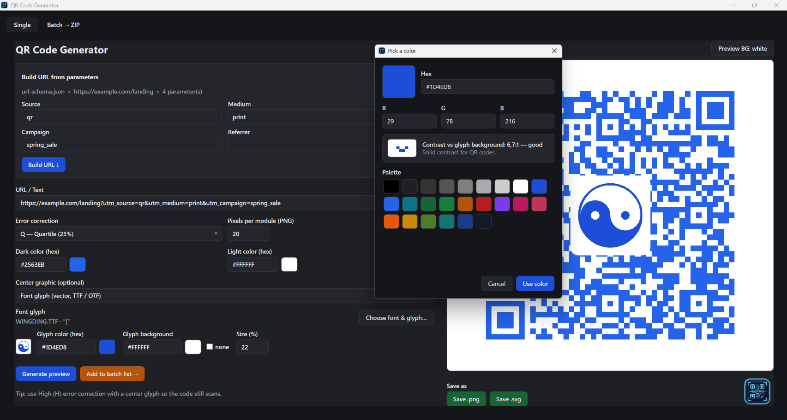

# QR Code Generator


A small Windows desktop app (WPF) that turns URLs into QR codes, with **PNG and SVG**
output, center logos, a schema-driven URL builder, and batch export.



## Download

Grab the latest **`QrCodeGenerator.exe`** from the
[Releases page](https://github.com/sascha-codeforfun/QrCodeGenerator/releases) and run it —
**no install needed.**

The build is self-contained (the .NET runtime and WPF are bundled into the exe), so it runs
on a clean machine with no .NET installed. Every release is provenance-attested and ships
with a SHA-256 checksum (`QrCodeGenerator.exe.sha256`).

> On first launch Windows SmartScreen may warn about an unsigned app — choose
> **More info → Run anyway**. That's expected for an unsigned binary.

## Requirements

- 64-bit Windows
- No .NET installation required (the runtime is bundled into the exe)

## Features

- **PNG and SVG export** — the SVG stays razor-sharp at any size.
- **Center graphic** — drop a logo in the middle of the code, either a raster image
  (PNG/JPG) or, better, **vector glyphs pulled straight from a font** (TTF/OTF) so they
  scale cleanly. Sits on a white rounded pad for readability.
- **Schema-driven URL builder** — define your parameters in `url-schema.json` and fill
  them in the UI. A single default renders a textbox; a list of defaults renders a
  dropdown. Builds `DOMAIN/PREFIX?name=value&…` into the URL box.
- **Batch → ZIP** — paste a list of URLs and get a ZIP of QR `.svg` files. Filenames are
  derived from each URL with the protocol and subdomain stripped and every non
  `a–z`/`0–9` character replaced by an underscore.
- **Add to batch** — send a URL crafted on the Single tab straight to the batch list,
  with de-duplication so a double-click can't queue it twice.
- Adjustable error-correction level, module size (PNG resolution), and custom colors.

## Build from source

Requires the [.NET 8 SDK](https://dotnet.microsoft.com/download) on Windows.

```bash
dotnet run                 # build and launch
dotnet build -c Release    # release build
```

To produce the self-contained single-file exe locally:

```bash
dotnet publish -c Release -r win-x64 --self-contained true ^
  -p:PublishSingleFile=true -p:IncludeNativeLibrariesForSelfExtract=true ^
  -p:EnableCompressionInSingleFile=true
```

Releases are built automatically by the GitHub Actions workflow in
`.github/workflows/main.yml` when a release is published.

## The URL schema (`url-schema.json`)

```json
{
  "domain": "https://example.com",
  "prefix": "landing",
  "parameters": [
    { "name": "utm_source",   "label": "Source",   "default": "qr" },
    { "name": "utm_medium",   "label": "Medium",   "default": ["print", "email", "social", "web"] },
    { "name": "utm_campaign", "label": "Campaign", "default": "spring_sale" },
    { "name": "ref",          "label": "Referrer", "default": "", "omitIfEmpty": true }
  ]
}
```

| Field | Required | Meaning |
|-------|----------|---------|
| `domain` | yes | Base domain, including scheme. |
| `prefix` | no | Path after the domain; slashes are normalized. |
| `parameters[].name` | yes | The query key. |
| `parameters[].label` | no | Friendly label for the input; falls back to `name`. |
| `parameters[].default` | no | A single value → textbox; a list of values → dropdown (first pre-selected). |
| `parameters[].omitIfEmpty` | no | Defaults to `true`; a blank value is left out of the URL. |

The example schema ships next to the exe and auto-loads on startup; use **Load schema…**
to point at a different file.

## Fonts for the center glyph

WPF's glyph APIs read **TTF, OTF and TTC**. They do **not** read **WOFF/WOFF2** — convert
those to TTF/OTF first. Use **High (H)** error correction with a center graphic so the code
still scans, and check it with your phone before relying on it.

## License

MIT — see [LICENSE.txt](LICENSE.txt).
QR generation uses [QRCoder](https://github.com/codebude/QRCoder) (MIT).

## Trademarks

"QR Code" is a registered trademark of DENSO WAVE INCORPORATED. This project is
not affiliated with, sponsored by, or endorsed by Denso Wave. The trademark
applies only to the term "QR Code"; the underlying technology is open and free
to use.

## Built with Claude

Almost this entire app — features, workflow, this README — was created from a handful of
short, plain-English prompts to Claude. The full list of prompts is in
[input.md](input.md), kept as-is to show how little input it took.
